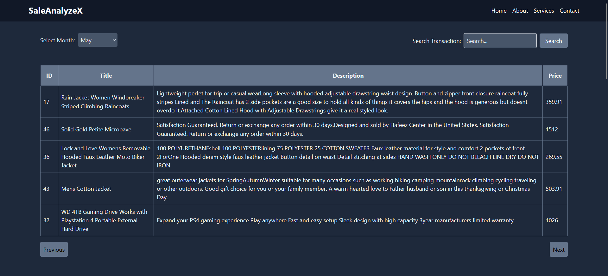
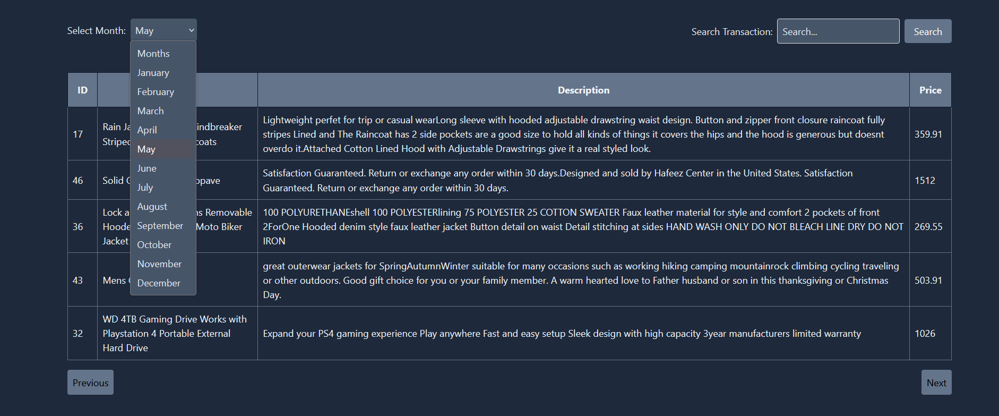
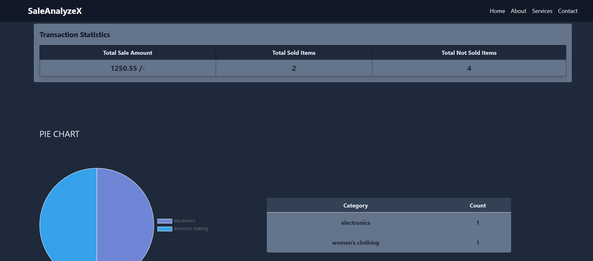
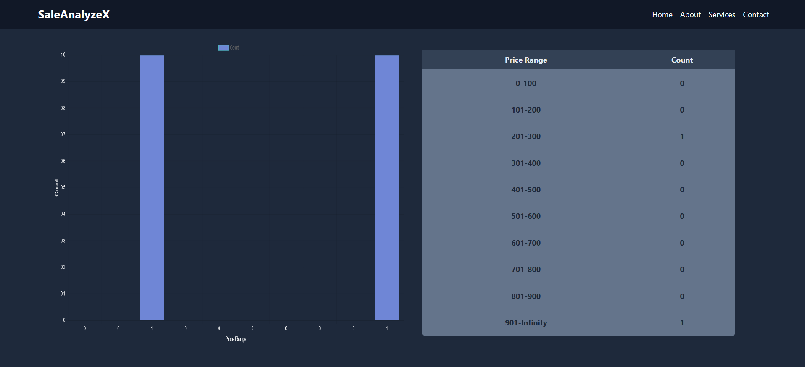

# Combined Dashboard Project

Welcome to the Combined Dashboard project! This project is designed to provide a comprehensive dashboard that combines transaction data, statistics, and visual representations for better insights. The dashboard is built using React and leverages Axios for handling API requests.

## Features


- **Transaction Overview:** View a detailed table of transactions, including ID, title, description, and price. Navigate through different pages to explore your data efficiently.


- **Month Selection:** Choose a specific month to filter transactions and analyze data for a particular timeframe.

- **Search Functionality:** Search for transactions based on keywords to quickly find relevant information.




## Getting Started

### Prerequisites

- Node.js and npm installed

### Installation

```bash
git clone https://github.com/jacodegithub/SaleAnalyzerX.git
cd SaleAnalyzerX
npm install
